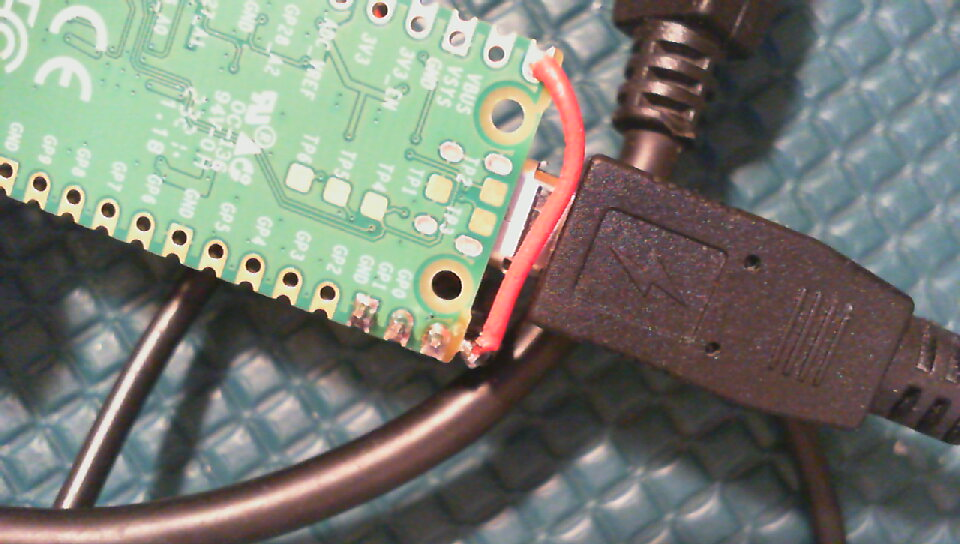
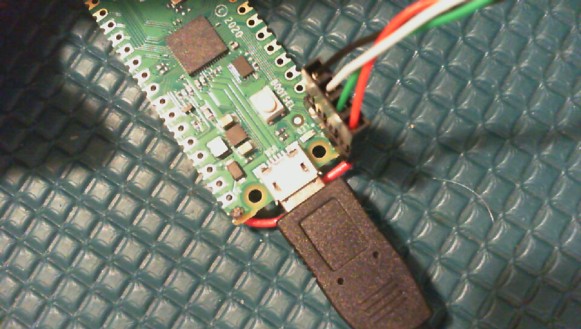
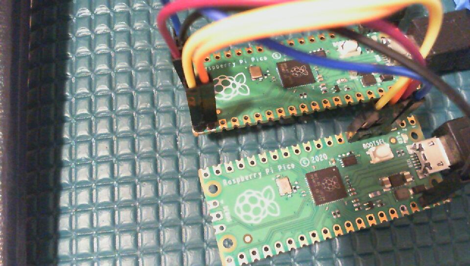

# pico-usb-midi-filter

## Description
This project uses the Raspberry Pi Pico built-in USB port and an additional USB port created from the PIOs
to make a MIDI data filter. You plug the PC into the Raspberry Pi Pico's MicroUSB port. You plug your
MIDI keyboard or other MIDI device into the added USB Host port. The added USB Host port enumerates your MIDI device
and then initializes the Pico's USB Device port so it looks to your PC just the same as the downstreams
USB device. Because the Pico now sits between your PC and your MIDI device, it can maniputlate the MIDI
data stream to filter it as required.

This program demonstrates demostrates translating some
Mackie Control protocol button messages from the Arturia Keylab Essential 88 to other Mackie Control protocol
button messages so that they work correctly with the Cubase DAW, and it demostrates Mackie Control fader pickup (because
it seems Arturia Keylab Essential only supports pickup with HUI. See the [FAQ](https://support.arturia.com/hc/en-us/articles/4405741358738-KeyLab-Essential-Tips-Tricks)). However, the code is
structured so that it may be modified to perform just about any other
filtering. That is, this code should serve as a reasonable starting point for other more sophisticated processing such as

- Removing MIDI clock or Activie Sensing messages
- Transposing notes
- Re-scaling note velocity
- Inserting controller messages or program change messages
- Changing MIDI channel for notes in a range (to perform keyboard split, for example).
- etc.

This project requires correctly soldering a USB host port connector to a Raspberry Pi Pico board. 
The circuit described here has no current limiting, ESD protection, or other safeguards. Measure voltages carefully and
please don't hook this to your expensive computer and MIDI equipment until you have done some testing with at least
some basic test equipment.

Also, any brand name stuff I mention in this README file is just documentation of what I did.
This is not an advertisement. I don't get paid to do this.

This project would not have been possible without the code of the tinyusb project and the
Pico-PIO-USB project. Thank you to the developers for publishing the source on github.

If you find issues with this document or with the code, please report them on this project's github page.

## Hardware

This project uses the built-in USB port as the USB downstream MIDI device port (connects to a
PC's USB host port or an upstream USB hub port). It also uses two GPIO pins, both PIOs and one of
the ARM cores of the Pico's RP2040 chip to create an upstream USB MIDI host port (connects
to your MIDI keyboard or other MIDI device). The Pico board and the MIDI device get power from the PC host port
or upstream USB hub. Because this project uses the on-board USB for MIDI, it can't use it for
stdio debug prints. This project uses UART0 on pins GP16 (Pico Board pin 21) and GP17 (Pico Board
pin 22) for the stdio debug UART. If your project needs the debug UART pins for something else, please
disable the stdio UART in the Cmake file.

### Wiring the USB Host Port
I used a [Sparkfun CAB-10177](https://www.sparkfun.com/products/10177) with the green and white
wires (D+ and D- signals) swapped on the 4-pin female header connector. I soldered a 4-pin male header
to pins 1-3 of the Pico board and left one of the pins hanging off the edge of the board. I soldered
a wire from that pin hanging off the edge of the board to Pin 40 of the Pico board (VBus). I then
plugged the 4-pin female header connector so the black wire (ground) connects to Pin 3 of the Pico
board, the red wire connects to pin hanging off the edge of the Pico board, the green wire connects
to pin 1 of the Pico board, and the white wire connects to pin 2 of the Pico board. If you want to
add series termination resistors to D+ and D-, resistors between 22 and 33 ohms are probably close. I didn't bother and it seemed good enough for my testing. Here are photos of the bottom view  and the top view  of how I wired the USB host cable.

### Wiring for a Pico Probe
I like to use a Pico Probe (see Appendix A of the [Getting Started with
Raspberry Pi Pico](https://datasheets.raspberrypi.com/pico/getting-started-with-pico.pdf) guide)
for code development in a Microsoft Visual Studio Code IDE. I soldered in a 3-pin male header on the
3 DEBUG pins at the bottom edge of the Pico board. I also soldered a 2-pin male header to pins
21 and 22 (GPIO pins GP16 and GP17) for the debug UART. I wired the GND, SWCLK and SWDIO as shown
in the Appendix. However, because I used Pico board pins 1 and 2 for the USB host, I had to wire
the debug UART to different pins. Connect the Pico A UART 1 Rx on Pico A pin 7 to Pico B UART0 Tx signal on Pico B
Pin 21 (not 1). Connect the Pico A UART Tx on Pico A pin 6 and the Pico B UART0 Rx signal to target Pico board pin 22 (not 2). Here is a photo of my complete setup with the Pico Probe attached. The Pico Probe board is the lower Pico board. 

### This is not commercial quality hardware
The USB host port hardware created from the PIO is not compliant
with the USB specification, but it seems to work OK in my experimental setup. The specification
deviations that I know about are:

- The D+ and D- pins use the on-chip pull-down resistors that can be between 50k and 80k instead
of the 15k pull-down resistors the USB spec recommends.
- The D+ and D- pins are wired directly to the I/O pins and don't use termination resistors to match
the 50 ohm impedance the USB spec recommends. You can try to do better by adding in-line
resistors as described above.
- The USB port receiver is not differential. The software that decodes the USB signaling only uses
the D+ signal to decode the NRZI signal.
- I wired in no current limiting for the USB host port Vbus supply. It relies on the current limiting
from the upstream PC's USB host that supplies power to the Pico board.

Someone who has an oscilloscope capable of looking at the USB eye pattern should recommend correct resistor
values to fix termination issues given you can't easily place resistors close to the pins on the RP2040
chip on an off-the-shelf Raspberry Pi Pico board.

## Software

This project relies on the [Raspberry Pi Pico SDK](https://github.com/raspberrypi/pico-sdk).
Because the TinyUSB library does not yet support a MIDI host port in the mainline, and because
it does not have hooks to support device descriptor cloning, you
need to use my fork of the [tinyusb](https://github.com/hathach/tinyusb) project and
check out the pio-midihost branch. Fortunately, the TinyUSB library already incorporates
the [Pico-PIO-USB](https://github.c/sekigon-gonnoc/Pico-PIO-USB) project as a library
submodule. All instructions below assume that you are using a Linux command line environment
or similar.

### Set up your development environment
Before you start trying to build this code, please make sure you have a working development
environment. See the [Getting Started with
Raspberry Pi Pico](https://datasheets.raspberrypi.com/pico/getting-started-with-pico.pdf)
document for instructions. You will need the `git` command line utility plus other
development tools.

### Install the project software
Set your current directory to something appropriate (e.g. $HOME/projects) and then clone the pico-usb-midi-filter project:

```
git clone https://github.com/rppicomidi/pico-usb-midi-filter.git
```

### Installing the forked tinyusb library

The Pico SDK uses the main repository for tinyusb as a git submodule. Until the USB Host driver for MIDI is
incorporated in the main repository for tinyusb, you will need to use my forked version. This is how I do it.

1. If you have not already done so, follow the instructions for installing the Raspberry Pi Pico SDK in Chapter 2 of the 
[Getting started with Raspberry Pi Pico](https://datasheets.raspberrypi.com/pico/getting-started-with-pico.pdf)
document.

2. Set the working directory to the tinyusb library
```
cd [some directory where you installed the pico SDK]/lib/tinyusb
```
3. Create an "upstream" remote
```
git remote add upstream https://github.com/hathach/tinyusb.git
```
4. Change the "origin" remote to point at my fork
```
git remote set-url origin https://github.com/rppicomidi/tinyusb.git
```
5. Get the code from my fork into your local repository
```
git fetch origin
```
6. Get the midihost branch code branch
```
git checkout -b pio-midihost origin/pio-midihost
```
7. Get the code from the Pico-PIO-USB project into the tinyusb library source tree as a git submodule
```
cd hw/mcu/raspberry_pi
git submodule update --init Pico-PIO-USB
```

### Building from the command line and loading the Pico software using the file system interface

The command line build process is pretty common for most Pico projects. I have the pico-sdk installed in $HOME/projects/pico/pico-sdk.

```
export PICO_SDK_PATH=$HOME/projects/pico/pico-sdk/
cd [the parent directory where you cloned this project]/pico-usb-midi-filter
mkdir build
cd build
cmake ..
make
```
This process should generate the file `pico-usb-midi-filter\build\pico-usb-midi-filter.uf2`.
Connect a USB cable to your PC. Do not connect it to your Pico board yet.
Hold the BOOTSEL button on your Pico board and plug the cable to your Pico board's microUSB
connector. The Pico should automount on your computer. Use the PC file manager to drag and
drop the ``pico-usb-midi-filter.uf2` file to the Pico "file system". The Pico should
automatically unmount when the file copy is complete.

### Building and debugging using VS Code and the Pico Probe

These instructions apply for Ubuntu Linux. Before you use VS Code with this project the first time, open a terminal
window and type the following commands:

```
cd [the parent directory where you cloned this project]/
mkdir build
cd build
touch compile_commands.json
```

This project already includes a hidden `.vscode` directory that does
most of the heavy lifting for setting up the project for VS Code. I connect the Pico Probe's microUSB to the host PC via an external hub and and then I connect target Pico board's microUSB directly to the PC. For
reasons I can't explain, debug does not seem to work correctly otherwise.

I have the pico-sdk installed in $HOME/projects/pico/pico-sdk. I set up the environment using this script from the command line (I am using Ubuntu Linux that uses gnome-terminal):

```
#!/bin/sh
export PICO_SDK_PATH=$HOME/projects/pico/pico-sdk/
gnome-terminal -- openocd -f interface/picoprobe.cfg -f target/rp2040.cfg
gnome-terminal -- minicom -D /dev/ttyACM0 -b 115200
```

The first line after the shebang sets PICO_SDK_PATH so that the build works correctly. The first `gnome-terminal` command opens a new terminal window and runs the openocd server that talks to the Pico Probe. The second `gnome-terminal` command opens a minicom serial port console window.

Finally, from the original terminal where I ran this script I start VS Code using this command.

```
code
```

When VS Code launches, File->Open Folder... and choose the directory where you installed the pico-usb-midi-filter project. You will have to choose the arm-none-eabi-gcc compiler. Now you should be able to build and run this code as described in Chapter 7 of the 
[Getting started with Raspberry Pi Pico](https://datasheets.raspberrypi.com/pico/getting-started-with-pico.pdf) document.

## Testing

Before messing with a DAW, plug your MIDI device to the Pico's added USB host port and, from the Linux command line, type

```
amidi -l
```

You should see something like this if you have the Arturia KeyLab Essential plugged to the Pico's added USB Host port:

```
Dir Device    Name
IO  hw:1,0,0  Arturia KeyLab Essential 88 MID
IO  hw:1,0,1  Arturia KeyLab Essential 88 DAW
```

You will need to use the appriate Mac or PC Tools to run low level tests using those computers as hosts.

This program should just pass MIDI data transparently between the PC and whatever other MIDI device you have connected. If you plug an Arturia Keylab Essential keyboard to the Pico's added USB host port, and set the Controller Map to DAW mode, you can see the MIDI filter in action.

If you have an Arturia Keylab Essential, make sure
you set the keyboard Map Setup to DAW mode and you use Arturia Midi Control Center software to set the Controller Map DAW Mode to Mackie Control and the DAW Fader mode to Jump. The Mackie Control commands will
come out of virtual MIDI cable 1, which is called something like MIDIIN2 and MIDIOUT2 in Windows and DAW in Linux or Mac.

If you want to test it with Cubase, follow the instructions for setting up Cubase to work with Mackie control [here](https://steinberg.help/cubase_pro_artist/v9/en/cubase_nuendo/topics/remote_control/remote_controlling_c.html). With this code, the Save, Undo and Punch buttons work as the button labels suggest. The Metro button functions as the marker add button. And the faders will have soft pickup instead of
jumping the first time you move them.

## Creating your own MIDI filter

I created the filter I needed for my project. However, you may need
your own filter. The API for your filter is in `midi_filter.h`. Create a new filter source file (e.g., mykeyboard_split_filter.c)
and make sure you implement all functions in the midi_filter.h.
Remove `keylab_essential_mc_filter.c` from `CMakeLists.txt` and
replace it with the name of your filter source file. Rebuild
the project, and it all should just work.